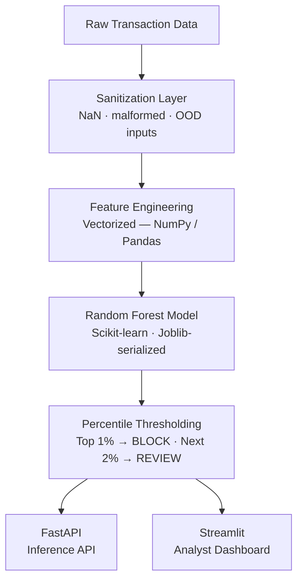

# Fraud Sentinel AI

> End-to-end fraud detection pipeline — from raw transaction data to containerized inference.


---

## Overview

Fraud Sentinel is a production-grade ML pipeline for real-time and batch fraud detection. The system is built around three principles: **defensive ingestion**, **vectorized throughput**, and **dynamic risk thresholding** — replacing static probability cutoffs with percentile-based alert logic that mirrors real-world banking operations.

> Developed with a human-AI collaborative workflow during prototyping, architecture design, and debugging.

---

## Architecture


---

## Key Design Decisions

| Decision | Rationale |
|---|---|
| Vectorized batch processing | Handles 555K+ rows in seconds; eliminates Python loop overhead |
| Percentile thresholding | Decouples alert rate from raw probability; handles class imbalance by design |
| Defensive ingestion layer | Prevents model-side crashes from malformed inputs; guarantees API uptime |
| Docker isolation | Reproducible serving environment; no dependency drift |
| Streamlit frontend | Rapid analyst-facing UI with no JS overhead |

---

## Tech Stack

| Layer | Tools |
|---|---|
| ML / Data | Scikit-learn, NumPy, Pandas, Joblib |
| Backend | FastAPI, Uvicorn, Python 3.11 |
| Frontend | Streamlit, Requests |
| Infrastructure | Docker, Docker Compose, Git, Poetry |

---

## Project Structure
```
end-to-end-fraud-detection/
├── app_ui.py                        # Streamlit dashboard entry point
├── pyproject.toml                   # Dependency management (Poetry)
├── Makefile                         # Common task shortcuts
├── docker/
│   ├── Dockerfile.serve             # Inference API image
│   ├── Dockerfile.train             # Training pipeline image
│   └── docker-compose.yml
├── fraud_detection/
│   ├── config.py                    # Central config / constants
│   ├── data/                        # Ingestion & sanitization
│   ├── features/                    # Vectorized feature engineering
│   ├── training/                    # Model training pipeline
│   ├── serving/                     # FastAPI inference engine
│   └── monitoring/                  # Prediction logging & drift hooks
├── models/
│   ├── model_v0.1.0.joblib
│   └── model_v0.1.0_metadata.json
├── logs/
│   └── predictions.jsonl
└── tests/
    ├── conftest.py
    ├── unit/
    └── integration/
```

---

## Quickstart

### Prerequisites

- [Docker](https://www.docker.com/) + Docker Compose
- Python 3.11+

### 1. Start the inference API
```bash
docker compose -f docker/docker-compose.yml up --build serve
```

API available at `http://localhost:8000`

### 2. Launch the dashboard
```bash
streamlit run app_ui.py
```

Dashboard available at `http://localhost:8501`

---

## Usage

**Single transaction** — Use the *Single Query* tab to submit individual transactions and inspect model output with risk label.

**Batch analytics** — Upload a `.csv` file in the *Batch Dashboard* tab. The pipeline processes the full dataset and returns an executive summary: blocked volume, amount at risk, and a filtered export of flagged transactions.

---

## Risk Classification
```
P(fraud) sorted descending across batch
├── Top 1%    →  BLOCK
├── Next 2%   →  REVIEW
└── Remaining →  PASS
```

Thresholds are computed per-batch at inference time, not hardcoded.

---

## License

[MIT](./LICENSE)